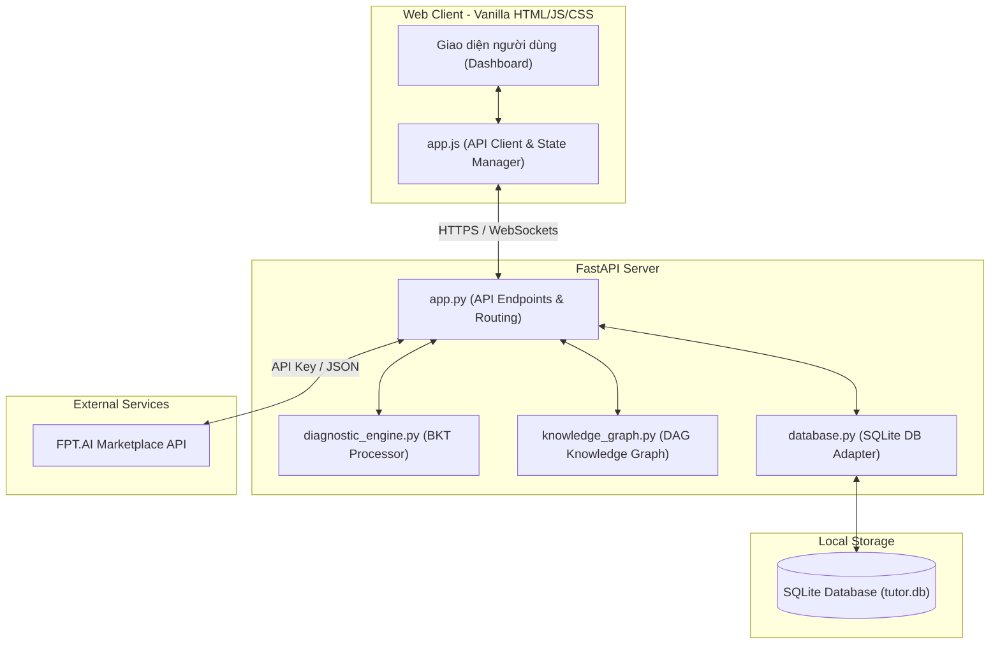

# Porcus AI — Hệ thống Chẩn đoán Lỗ hổng Kiến thức Toán học thích ứng

## 1. Mô tả bài toán và phạm vi hệ thống

### Bài toán đặt ra
Học sinh từ lớp 5 đến lớp 9 thường gặp khó khăn khi làm các bài tập Toán học mới không phải vì kiến thức lớp hiện tại quá phức tạp, mà do bị **hổng kiến thức nền tảng (kỹ năng tiên quyết)** từ các lớp trước. Giáo viên với sĩ số lớp học đông (35-45 học sinh) rất khó để theo dõi, chẩn đoán chính xác lỗ hổng gốc của từng em bằng phương pháp chấm điểm thủ công hay phán đoán cảm tính.

### Phạm vi hệ thống
Hệ thống **Porcus AI** được thiết kế như một công cụ chẩn đoán thông minh hỗ trợ giáo viên và học sinh:
- **Phía Học sinh (Adaptive Test):** Cung cấp các bài kiểm tra chẩn đoán thích ứng. Khi học sinh trả lời sai một câu hỏi, hệ thống sẽ tự động hạ độ khó hoặc lùi về kiểm tra kỹ năng tiên quyết trong Đồ thị kiến thức (Knowledge Graph) thay vì chọn câu hỏi ngẫu nhiên.
- **Phía Giáo viên (Teacher Dashboard):** Cung cấp bảng điều khiển trực quan gồm danh sách ưu tiên can thiệp (Priority List), tự động phân nhóm học sinh theo lỗ hổng kiến thức chung (Auto-Grouping), biểu đồ tiến trình và cây lập luận chẩn đoán (Reasoning Tree) cho từng học sinh.
- **Phạm vi kiến thức:** Hệ thống bao phủ 168 câu hỏi cho 58 kỹ năng Toán học chuẩn từ lớp 1 đến lớp 9 theo chương trình GDPT mới.
- **Mức độ tích hợp:** Hoạt động offline-first trên SQLite local để đảm bảo khả năng chạy ổn định ngay cả trong môi trường mạng yếu của nhà trường, đồng thời tích hợp FPT.AI để tự động sinh gợi ý học tập Socratic và kế hoạch bài giảng hỗ trợ giáo viên.

---

## 2. Công nghệ sử dụng và môi trường chạy

### Công nghệ sử dụng
- **Backend Core:** Python 3.10+, FastAPI (phục vụ API hiệu năng cao và gọn nhẹ).
- **Thuật toán Chẩn đoán:** Bayesian Knowledge Tracing (BKT) để cập nhật xác suất thành thạo kỹ năng của học sinh sau mỗi câu trả lời.
- **Đồ thị kiến thức:** Đồ thị có hướng không chu trình (DAG - Directed Acyclic Graph) để biểu diễn mối quan hệ tiên quyết giữa các kỹ năng.
- **Database:** SQLite (chế độ local/offline) hỗ trợ lưu trữ cục bộ và đồng bộ dữ liệu.
- **Frontend:** Vanilla HTML5, CSS3 hiện đại, và JavaScript (ES6+) kết hợp mô hình cập nhật trạng thái động, không phụ thuộc vào các framework nặng nề như React hay Angular.
- **Tích hợp AI:** Adapter kết nối API FPT.AI (Marketplace Chat & Speech).
- **Deployment Platform:** Vercel (chạy Serverless 24/7, kết nối CI/CD tự động từ GitHub).

### Môi trường chạy và Yêu cầu cài đặt
- **Hệ điều hành hỗ trợ:** Windows, macOS, Linux.
- **Trình duyệt khuyến nghị:** Google Chrome, Microsoft Edge, Safari.
- **Yêu cầu cài đặt cơ bản:** Python 3.10 trở lên đã cấu hình trong biến môi trường PATH.

---

## 3. Cấu trúc thư mục và các module chính

```
fivelittlepigs2/
├── backend/                  # Mã nguồn xử lý Backend (FastAPI)
│   ├── app.py                # Điểm khởi chạy API và định tuyến chính
│   ├── config.py             # Cấu hình môi trường và đường dẫn
│   ├── database.py           # Quản trị cơ sở dữ liệu SQLite local
│   ├── diagnostic_engine.py  # Thuật toán Bayesian Knowledge Tracing (BKT)
│   ├── knowledge_graph.py    # Cấu trúc đồ thị kỹ năng lớp 5-9 (DAG)
│   └── fpt_ai.py             # Adapter tích hợp API FPT.AI
├── frontend/                 # Giao diện người dùng tĩnh (Vanilla HTML/JS/CSS)
│   ├── index.html            # Giao diện Dashboard học sinh & giáo viên
│   ├── app.js                # Logic tương tác, gọi API và cập nhật DOM
│   └── style.css             # Thiết kế giao diện (Responsive & Modern)
├── api/                      # Thư mục cấu hình phục vụ cho Vercel Serverless
│   └── index.py              # Entrypoint để Vercel chạy FastAPI
├── docs/                     # Tài liệu hướng dẫn và gói đánh giá
├── tests/                    # Bộ kiểm thử tự động (Pytest)
├── vercel.json               # Cấu hình định tuyến của Vercel
├── requirements.txt          # Các thư viện Python cần thiết
└── run.py                    # Script chạy local nhanh tự động mở trình duyệt
```

---

## 4. Biểu đồ thiết kế hệ thống (UML)

### Sơ đồ kiến trúc thành phần (Component UML)
Sơ đồ mô tả sự tương tác giữa các tầng Frontend, Backend, cơ sở dữ liệu SQLite cục bộ và API FPT.AI:



### Sơ đồ luồng chẩn đoán thích ứng (Activity UML)
Sơ đồ minh họa quá trình hệ thống chọn lựa câu hỏi tiếp theo dựa trên câu trả lời của học sinh:


