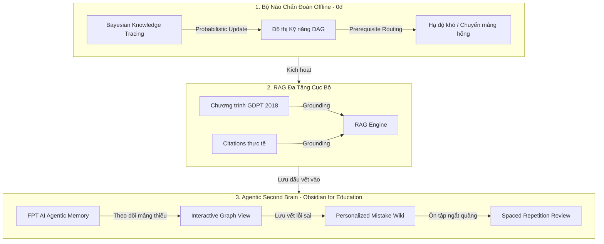

# PorcusAI: Định vị Lợi thế Cạnh tranh & Rào cản Công nghệ (Product Moat)

Để chuẩn bị cho vòng chung kết FPT AI Hackathon trước các đối thủ EdTech khác, PorcusAI xây dựng một **"Hào sâu công nghệ" (Product Moat)** vững chắc dựa trên 3 trụ cột độc bản dưới đây. Điều này chứng minh cho Ban Giám khảo thấy sản phẩm không thể bị sao chép dễ dàng bởi các chatbot hay AI wrapper thông thường.

---

---

## 1. RAG Đa Tầng Cục Bộ & Grounding Chặt Chẽ (Socratic Grounded RAG)
Các chatbot thông thường gọi RAG phẳng (Flat RAG), ném toàn bộ tài liệu vào LLM để sinh câu trả lời trực tiếp. PorcusAI xây dựng **Multi-Layer Grounded RAG** có cấu trúc:
*   **Không trả lời hộ:** RAG của PorcusAI không lấy tài liệu ra để "đọc hộ" học sinh. Hệ thống trích xuất nội dung lý thuyết nền và các chỉ dẫn phân tích phân tâm học từ file `data/rag_knowledge.json` dựa trên **Node Kỹ năng hiện tại** đang bị hổng.
*   **Grounding Rubric:** Phối hợp chặt chẽ với Khung chương trình GDPT 2018 và Rubric đánh giá kỹ năng của Bộ Giáo dục. AI chỉ được phép dùng tài liệu này làm ngữ cảnh để đặt câu hỏi gợi mở (Socratic tutoring), đảm bảo tính sư phạm chính xác tuyệt đối và loại bỏ hoàn toàn hiện tượng ảo tưởng (hallucination).

---

## 2. Thuật toán Chẩn đoán Thích ứng BKT & Định tuyến DAG (Probabilistic Adaptive Engine)
Đây là rào cản thuật toán của PorcusAI, ngăn các hệ thống Rule-based hoặc LLM-only sao chép:
*   **BKT (Bayesian Knowledge Tracing):** Sử dụng xác suất để dự đoán mức độ thành thạo kỹ năng của học sinh (mastery probability) dựa trên chuỗi câu trả lời đúng/sai lịch sử, tự động điều chỉnh trọng số (BKT weight) khi phát hiện hành vi bất thường (học sinh trả lời quá nhanh hoặc khoanh bừa).
*   **Định tuyến ngược DAG (Prerequisite DAG Routing):** Khi học sinh gặp bế tắc (Priority Score tăng cao), hệ thống không hạ độ khó ngẫu nhiên. Nó duyệt ngược đồ thị định hướng (Directed Acyclic Graph) để tìm ra **Node kỹ năng tiên quyết gốc** ở lớp dưới (ví dụ: hổng phép cộng phân số lớp 5 khi đang làm toán số hữu tỉ lớp 7) để bắt đầu chẩn đoán thích ứng.
*   **Hiệu quả kinh tế:** Toàn bộ thuật toán chẩn đoán này chạy offline với chi phí tài nguyên bằng **0 đồng**, giúp hệ thống cực kỳ rẻ khi scale lên hàng triệu người dùng, triệt tiêu hoàn toàn gánh nặng chi phí API của các đội thi lạm dụng LLM để chẩn đoán.

---

## 3. Agentic Second Brain - Obsidian dành cho Học sinh (Trọng tâm Đột phá)
Đây là tính năng độc bản biến PorcusAI từ một công cụ làm bài tập thành một **"Trợ lý quản lý tri thức cá nhân" (Personal Knowledge Management - PKM)** cho học sinh.

### 🧠 Định nghĩa "Second Brain" Giáo dục:
Học sinh học trên lớp thường quên 80% kiến thức sau 48 tiếng. PorcusAI sử dụng **FPT AI Agentic Memory** để xây dựng một bản đồ tri thức cá nhân hóa (dạng Obsidian Graph View) đại diện cho bộ não của học sinh đó.

1.  **Bản đồ Mastery thời gian thực (Interactive Graph View):**
    *   Mỗi kỹ năng/khái niệm là một node trong mạng lưới liên kết. 
    *   Node màu xanh = Học sinh đã thành thạo (Mastered).
    *   Node màu vàng/đỏ = Mảng kiến thức bị khuyết thiếu (Knowledge Gaps).
    *   Đường liên kết (Edges) thể hiện mối quan hệ bổ trợ giữa các khái niệm. Học sinh nhìn vào đồ thị sẽ thấy trực quan "bộ não" của mình đang bị hổng ở điểm nào.
2.  **Bộ nhớ Agent chủ động (FPT AI Agentic Memory):**
    *   Agent tự động lưu lại các bước chẩn đoán thích ứng và các phản hồi Socratic.
    *   Nhớ chính xác lỗi tư duy của học sinh (ví dụ: *Emma thường cộng trực tiếp tử số với tử số, mẫu số với mẫu số khi làm toán phân số*).
    *   Chủ động nhắc nhở ôn tập ngắt quãng (Spaced Repetition) đúng vào mảng hổng trước kỳ thi.
3.  **Wiki Lỗi sai Cá nhân hóa (Personalized Mistake Wiki):**
    *   Mỗi khi học sinh làm sai và được Socratic Tutor giải thích, AI Agent sẽ tự động tạo một trang Wiki ghi chú (Obsidian-style note) mô tả lại lỗi sai đó bằng ngôn ngữ sư phạm dễ hiểu.
    *   Đây là "Second Brain" đồng hành cùng học sinh: Càng làm bài, cuốn sổ tay lỗi sai này càng dày lên và thông minh hơn, giúp học sinh ôn tập trúng đích thay vì học lan man.

---

## 🎤 Cách trình bày Moat này trước Ban Giám khảo:

> *"Kính thưa Ban Giám khảo, nếu chúng tôi chỉ xây một chatbot gọi API OpenAI, dự án sẽ chết ngay ngày mai khi các tập đoàn lớn ra tính năng tương tự. **Sự khác biệt của PorcusAI nằm ở 3 điểm:**"*
>
> 1.  *Chúng tôi chẩn đoán bằng thuật toán toán học BKT/DAG chạy cục bộ với chi phí 0đ, không phụ thuộc vào Internet hay API LLM.*
> 2.  *AI chỉ được dùng làm Socratic Tutor (không bao giờ lộ đáp án) và được grounding chặt chẽ theo chương trình GDPT 2018.*
> 3.  *Quan trọng nhất, PorcusAI là **Trợ lý quản lý tri thức cá nhân (Second Brain)** cho học sinh. Nó trực quan hóa lỗ hổng dưới dạng sơ đồ liên kết Obsidian, nhớ chính xác lỗi tư duy của từng học sinh và chủ động nhắc ôn tập. Đây là hào sâu công nghệ và giá trị độc bản giúp chúng tôi đồng hành lâu dài cùng người học.*
